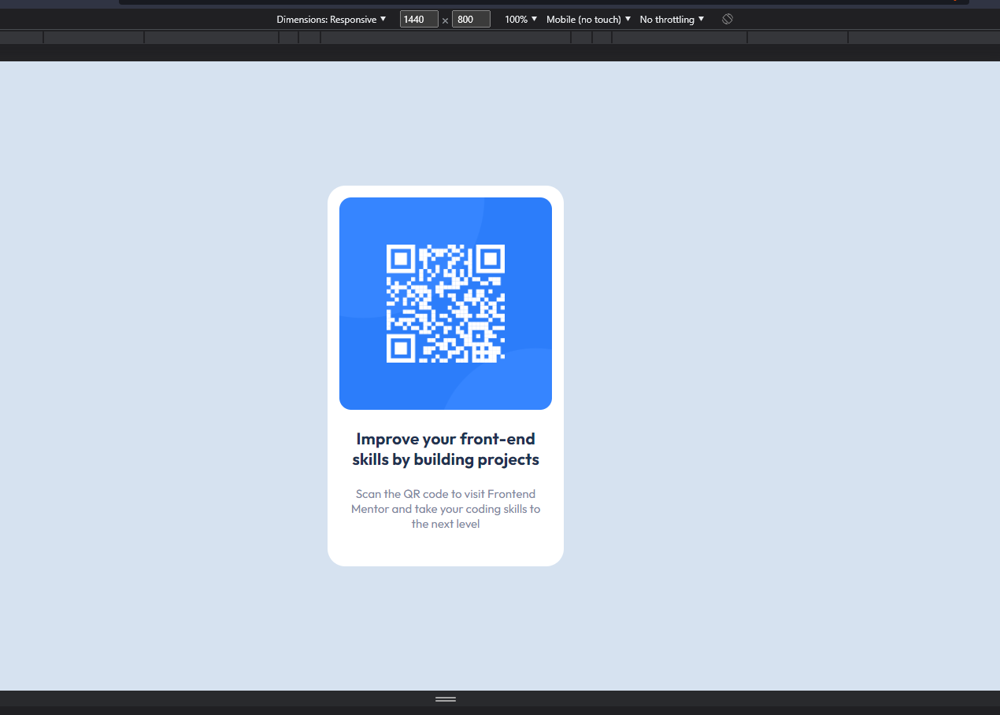
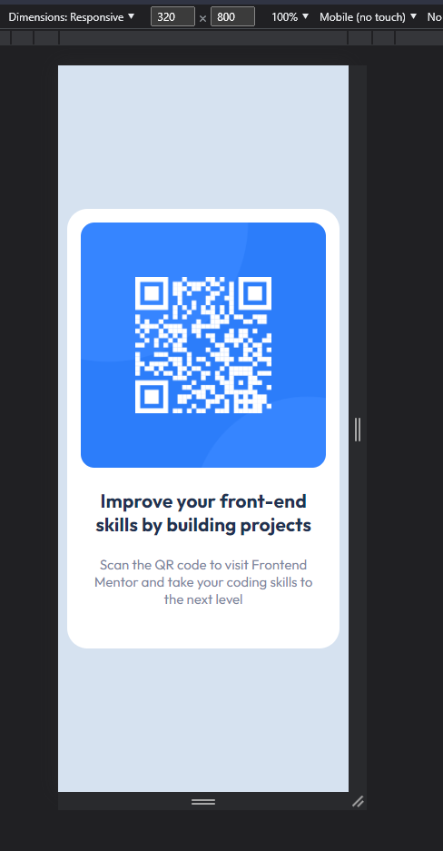

# Frontend Mentor - QR code component solution

This is a solution to the [QR code component challenge on Frontend Mentor](https://www.frontendmentor.io/challenges/qr-code-component-iux_sIO_H). Frontend Mentor challenges help you improve your coding skills by building realistic projects. 

### Screenshot

### Links

- Live Site URL: [Netlify](https://amazing-baklava-c3b88f.netlify.app/)

### Built with

- HTML5
- CSS custom properties
- Flexbox

## Author

- Frontend Mentor - [@egolam](https://www.frontendmentor.io/profile/egolam)
- Twitter - [@robot4qbu](https://www.twitter.com/robot4qbu)